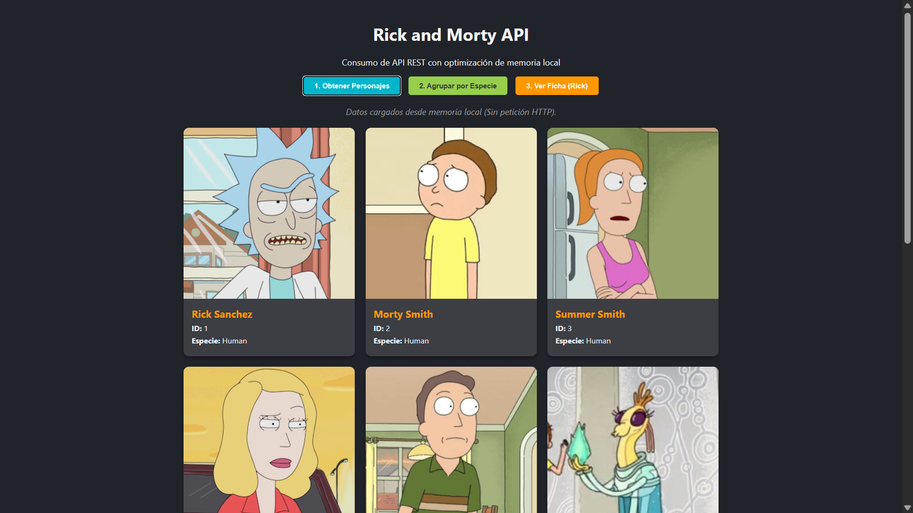
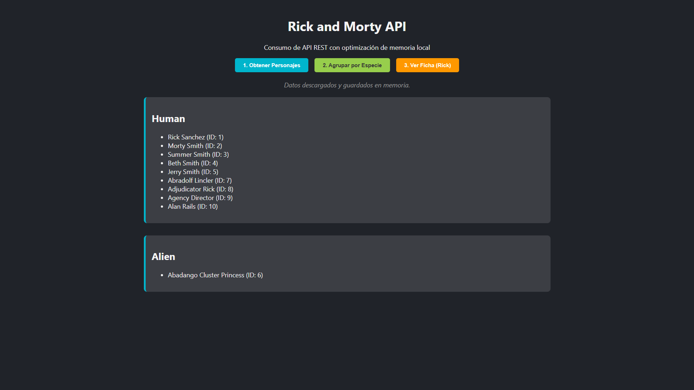
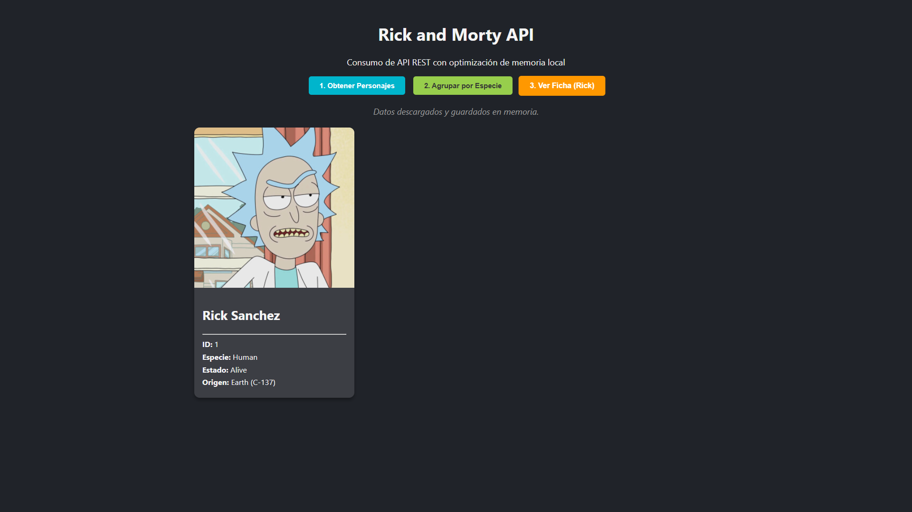

# Rick and Morty API - Consumo Optimizado


## Descripción
Aplicación web que consume la API pública de **Rick and Morty** para listar, filtrar y visualizar personajes.

El proyecto implementa un patrón de **optimización de recursos**: realiza la petición HTTP (`fetch`) una única vez y almacena la respuesta en una variable de estado local (`datosLocales`). Las interacciones subsiguientes consumen estos datos en memoria, eliminando la latencia de red.

## Funcionalidades
1. **Consumo de API:** Obtiene los primeros 10 personajes vía `GET`.
2. **Visualización:** Renderizado de tarjetas con imagen y metadatos.
3. **Agrupación:** Algoritmo que clasifica personajes por Especie (*Human, Alien, etc.*).
4. **Ficha Técnica:** Vista detallada de un personaje específico.

## Stack Tecnológico
- HTML5 Semántico
- CSS3 (Grid Layout & Flexbox)
- JavaScript ES6+ (Async/Await, Fetch API)

## 📂 Estructura del Proyecto

```text
M4_EP6/
├── index.html       # Interfaz de control
├── img/             # Evidencias de implementación
│   └── styles.css   # Estilos visuales
├── js/
│   └── script.js    # Lógica del proyecto
└── README.md        # Documentación técnica
```

## Evidencias

### 1. Obtener personajes


### 2. Agrupar por especie


### 3. Ver ficha (Rick)


## Instalación

**Clonar el repositorio:**

git clone [https://github.com/Lfiedlerf/M4_EP7.git](https://github.com/Lfiedlerf/M4_EP7.git)

## Autor
**Luis Fiedler** - Desarrollador en formación
[Perfil de GitHub](https://github.com/Lfiedlerf/)